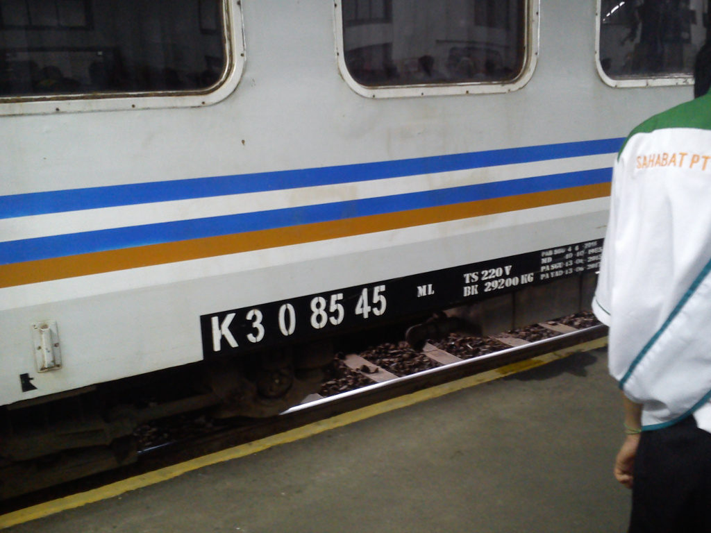
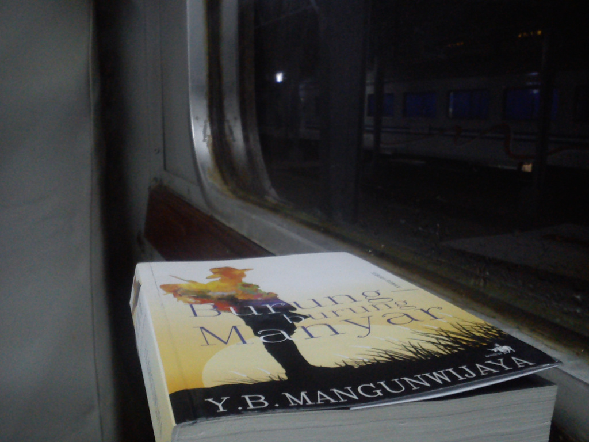
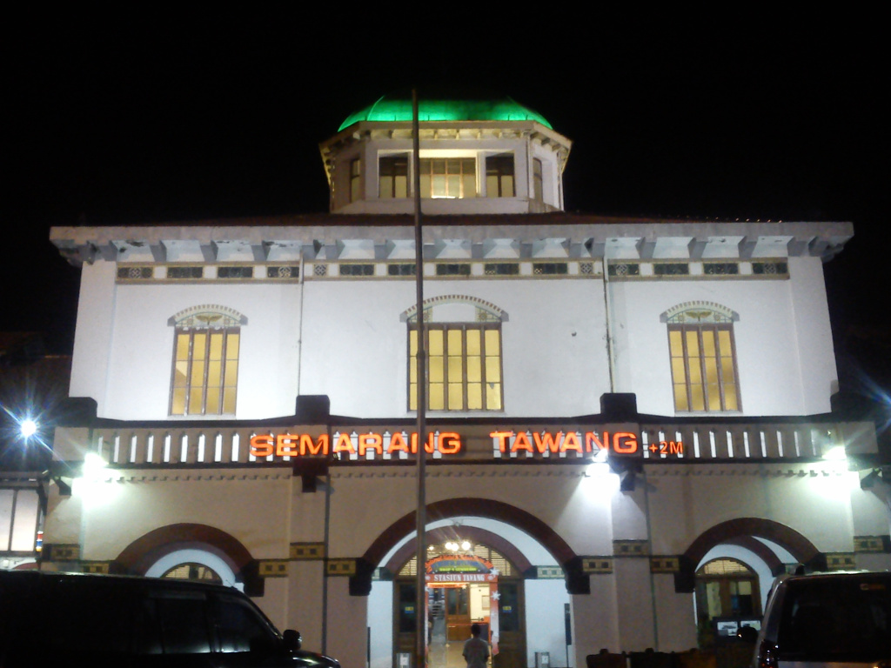
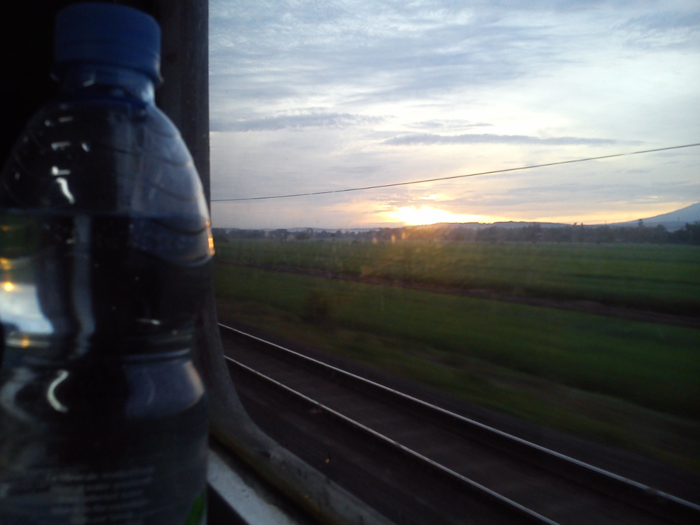
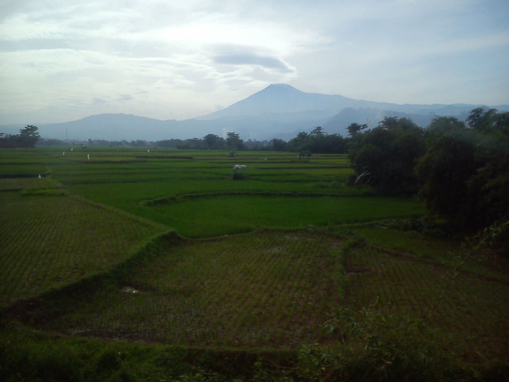
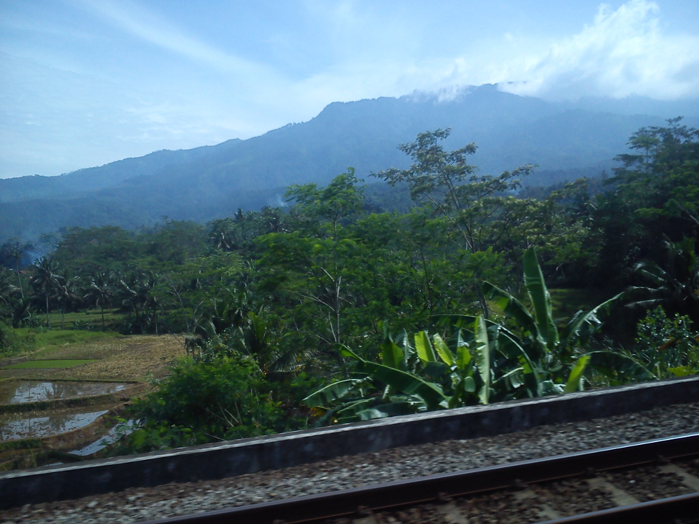
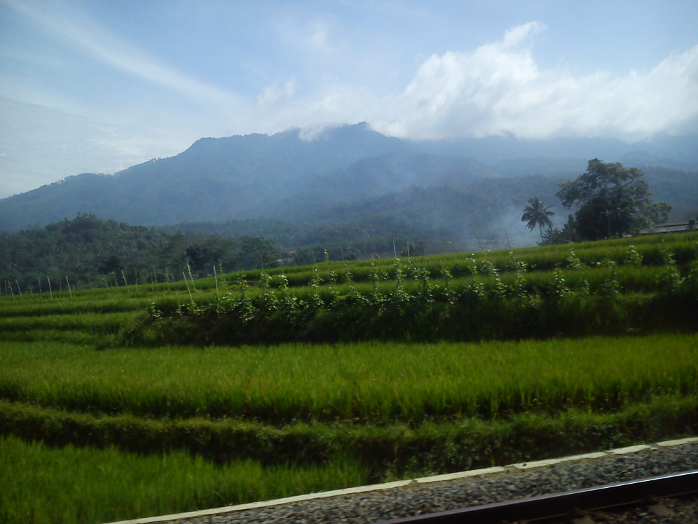
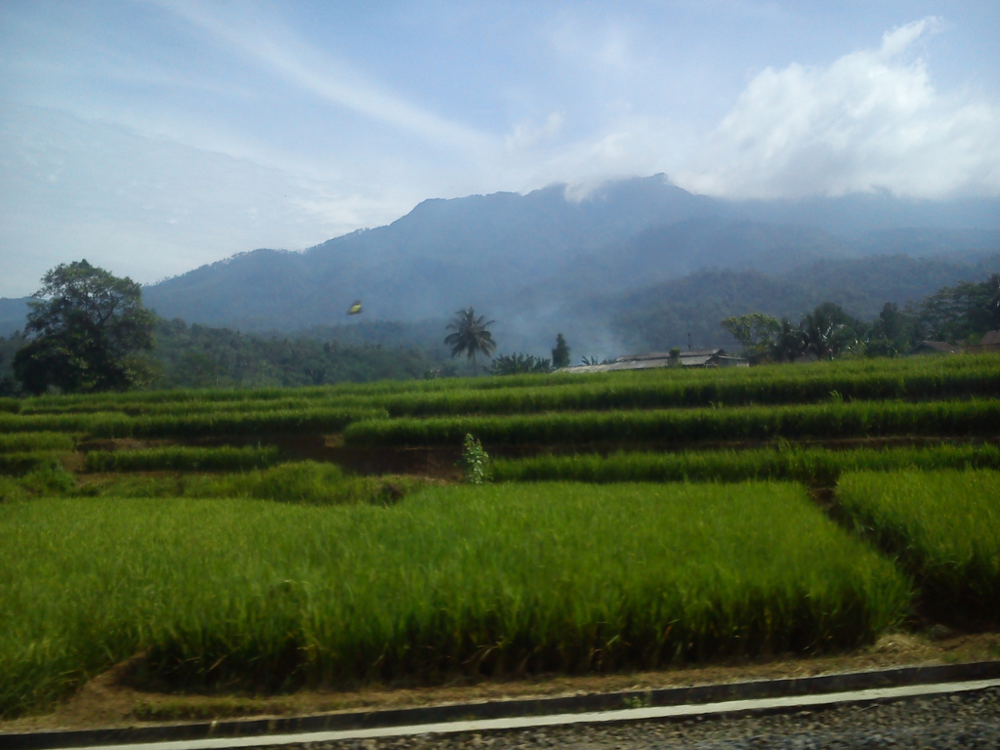

Hari minggu kemarin, tanggal 25, mumpung sudah masuk minggu tenang, saya sempatkan untuk pulang ke Purbalingga. Lumayan, ada waktu cukup untuk berlibur di rumah daripada _gabut_ di kontrakan yang hampir kosong ditinggal anak-anak kontrakan. Biasanya, kalau pulang, saya naik Logawa dari Surabaya Gubeng. Berangkat setengah lima pagi dari stasiun Malang naik kereta lokal, sampai di Surabaya Gubeng sekitar setengah delapan dan harus tunggu Logawa sampai jam sembilan seperempat. Tapi hari minggu kemarin, saya mencoba naik kereta lewat Semarang (Logawa tidak lewat Semarang). Alasannya, jadwal KA Logawa diundur satu jam, dan jadwal yang tadinya milik KA Logawa sekarang diisi KA eksekutif baru, Ranggajati. Saya tidak mau menunggu satu jam lebih lama atau membayar lebih untuk naik Ranggajati. Terus, saya juga masih penasaran dengan pemandangan di sekitar jalur Tegal-Purwokerto yang letaknya di sekitaran Gunung Slamet. Terakhir kali lewat jalur itu saat pulang dari Cilegon naik KA Krakatau, sayangnya saat itu sudah agak gelap jadi kurang jelas pemandangannya. Jadi, saya coba saja pulang lewat Semarang.

Sejak awal Desember, saya sudah mencari tiket kereta. Dan untungnya masih kebagian tempat untuk tanggal 25 kemarin. Saya dapat satu tempat di KA Matarmaja untuk Malang-Semarang Tawang dan satu tempat di KA Kamandaka untuk Semarang Tawang-Purwokerto\*. Biaya yang saya keluarkan untuk Matarmaja Rp 109.000 dan Kamandaka Rp 80.000, jadi totalnya Rp 189.000. Memang lebih mahal dibandingkan dengan KA Logawa (Rp 74.000), bahkan dua kali lipatnya. Tapi paling tidak masih lebih murah dibandingkan dengan Ranggajati. Kalau mau kereta yang langsung Malang-Purwokerto, boleh lah naik Gajayana atau Bima, yang penting ada uang. Heuheu.

Minggu, 25 Desember, tepat pukul 17.00, KA Matarmaja berangkat dari stasiun Malang melewati jalur selatan Jawa Timur (Blitar, Tulungagung, Kediri, Kertosono). Awal perjalanan disuguhi dengan pemandangan pemukiman padat di Kota Malang, lalu area persawahan di Malang _Coret_, sebelum akhirnya hari menjadi gelap dan susah untuk melihat apa yang ada di luar. Di kereta, saya satu bangku dengan mahasiswa elektro ITS asal Jakarta, yang sebelumnya main di Malang. Lumayan ada teman ngobrol, terutama tentang perkuliahan. Selain itu, saya juga selalu bawa bekal buku untuk bacaan di perjalanan. Sudah jadi kebiasaan saya untuk membawa buku setiap naik kereta. Buku yang saya bawa itu novel setebal 405 halaman berjudul Burung-burung Manyar karangan Y.B. Mangunwijaya, yang bercerita tentang pergolakan batin seorang pejuang "inlander" yang memihak Belanda dan jatuh cinta pada wanita yang memihak republik. Saya baca per bab, lalu istirahat untuk melihat perjalanan sudah sampai mana sebelum saya lanjutkan membaca. Sebelum perjalanan, saya sempat minum kopi instan satu botol. Dan malamnya, saat kebanyakan orang tidur, saya masih kuat _melek_ untuk membaca novel sampai di Semarang.

KA Matarmaja yang dijadwalkan sampai di Semarang Tawang pukul 02.27, ternyata baru sampai pukul 03.05. Telat 38 menit. Saya langsung turun dari kereta dan langsung menuju ruang tunggu, di situ saya teruskan membaca lagi sambil menunggu KA Kamandaka yang berangkat pukul 05.00. Stasiun Semarang Tawang masih termasuk dalam kompleks Kota Tua Semarang, dan saya tahu Gereja Blenduk cukup dekat dengan stasiun. Awalnya saya berencana untuk berjalan-jalan sebentar ke Gereja Blenduk, tapi, yah, karena masih dini hari dan saya sendirian serta masih belum tahu keadaan sekitar, saya urungkan dulu niat jalan-jalan saya. Mungkin lain kali kalau saya ada teman akan saya sempatkan main ke kompleks Kota Tua.

Pukul empat seperempat, KA Kamandaka diumumkan sudah bisa dimasuki penumpang. Saya langsung naik ke kereta dan pukul 05.00 tepat kereta berangkat. Tidak banyak penumpang yang naik dari Semarang Tawang, tetapi cukup banyak yang naik dari Semarang Poncol. Setelah semalaman _melek_, baru di pagi hari itulah saya mulai ngantuk. Beberapa kali saya tertidur saat membaca, tapi tidak lama. Dan novel itu pun selesai saya baca sebelum masuk Stasiun Tegal. Bagi saya itu sebuah pencapaian bisa menyelesaikan sebuah novel dalam waktu kurang lebih satu malam.

Jalur utara ini cukup unik, karena di beberapa titik rel kereta hanya berjarak beberapa meter di sebelah Laut Jawa. Jadi dari kereta kita bisa lihat Laut Jawa yang cukup tenang. Tadinya saya ingin ambil gambar Laut Jawa ini, tapi tempat duduk saya bukan di sisi yang menghadap ke laut dan saya sendiri sungkan untuk keluar tempat duduk hanya untuk ambil gambar. Jadi, yah, saya hanya bisa lihat tanpa bisa ambil gambar. Paling tidak saya ada di sisi yang langsung menghadap Gunung Slamet.

Setelah melewati Stasiun Tegal, kereta berjalan mengarah ke selatan. Hamparan sawah hijau masih menjadi pemandangan yang sering muncul dengan beberapa perbukitan di sana-sini dengan latar belakang Gunung Slamet. Lalu melewati Stasiun Pupruk, titik bertemunya jalur dari Tegal dan Cirebon. Setelah melewati Pupruk, mulai terasa suasana khas DAOP V Purwokerto, perbukitan, sungai-sungai lebar, sawah hijau, dan tentunya Gunung Slamet. Rasa penasaran saya pun akhirnya terbayarkan. Dan saking menikmati pemandangan, saya lupa untuk mendokumentasikannya. Tapi beberapa gambar bisa saya ambil sebelum sampai di tujuan akhir Purwokerto.

Akhirnya, pukul 09.45, KA Kamandaka tiba di Purwokerto, telat tiga menit dari sesuai yang dijadwalkan pada pukul 09.42. Di Stasiun Purwokerto ini saya ditunggu bapak saya dan lalu pulang ke Purbalingga.

Perjalanan ini memakan waktu lebih dari 16 jam, lebih lama dibandingkan dengan perjalanan naik Logawa yang kurang lebih memakan waktu 14 jam. Tapi, paling tidak, menurut saya ada lebih banyak pengalaman yang bisa didapatkan. Lain kali saat transit di Semarang bisa lah coba jalan-jalan ke Kota Tua, syukur ada teman juga. Jadi, ada yang mau ikut?

_\*: Di Purbalingga belum ada stasiun, dan stasiun terdekat (padahal jauh) cuma di Purwokerto. Begitu juga dengan bus, belum ada PO yang melayani rute Purbalingga-Malang sampai saat ini, hanya ada di Purwokerto._
