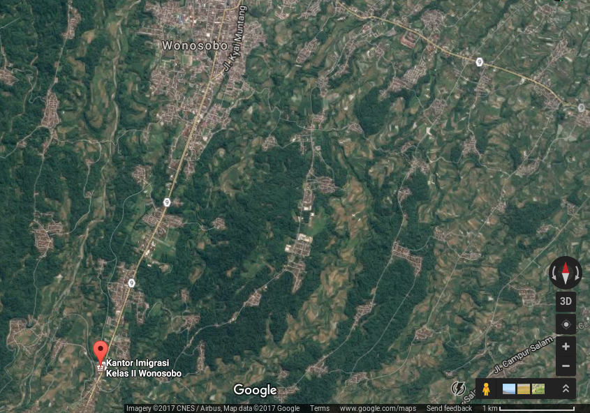
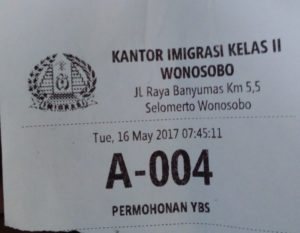
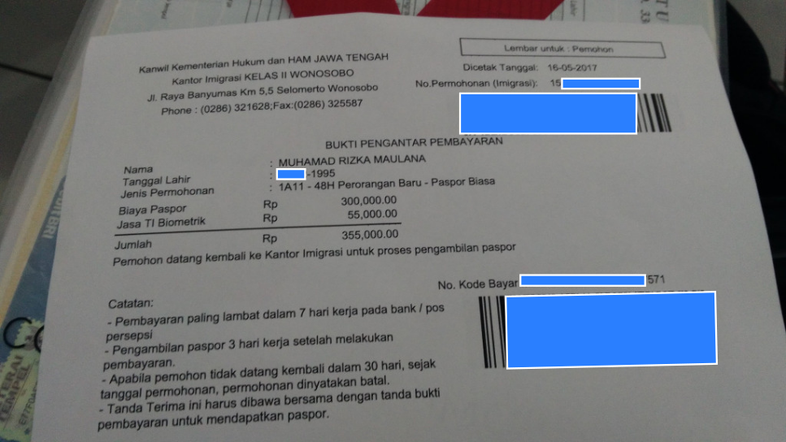
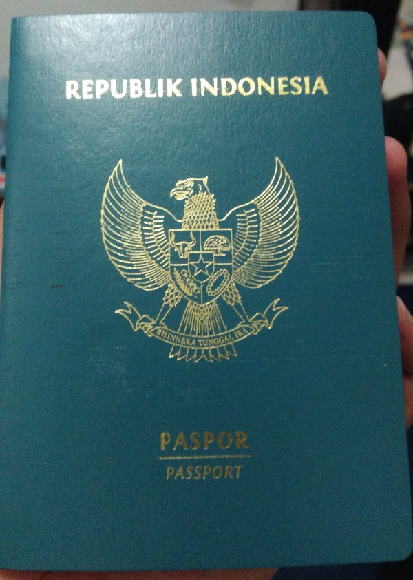

Hmm... Dua bulan sudah saya tidak mengisi apapun di blog ini. Sebenarnya ada banyak yang ingin saya bagikan di sini selama dua bulan terakhir, namun rasanya berat sekali hanya untuk menulis beberapa kalimat. Untuk menyelesaikan tulisan ini saja saya harus memaksa diri sendiri. Kejadian yang ada di tulisan ini sudah berlalu 3 minggu lalu, namun saya merasa punya kewajiban untuk berbagi pengalaman dan saya tidak mau menunda lagi untuk menuliskannya. Takutnya saya lupa.

Jadi, tanggal 15 dan 16 Mei kemarin, saya mengurus paspor di Kantor Imigrasi Wonosobo. Buat paspor untuk apa? Hehe, nanti juga tahu. Tadinya saya ingin mengurus di Kantor Imigrasi Malang, namun karena berkas-berkas persyaratannya ada di Purbalingga, maka, yah, terpaksa harus mengurus di kantor imigrasi terdekat dengan Purbalingga (BTW, kita bisa buat paspor di kantor imigrasi manapun, selama persyaratannya terpenuhi). Pilihan kantornya ada tiga: Cilacap, Wonosobo, dan Pemalang. Semua hampir sama jauhnya dari rumah dan butuh waktu tempuh paling tidak dua jam naik motor. Rencana awal mau mengurus di Kantor Imigrasi Cilacap, tapi banyak yang bilang kalau mengurus di Cilacap bakal lama dan ramai. Jadilah saya mencoba urus paspor di Kantor Imigrasi Wonosobo. Oh ya, persyaratan dasar yang harus disiapkan antara lain: 1. KTP dan fotokopinya. 2. Akte Kelahiran dan fotokopinya. 3. Kartu Keluarga dan fotokopinya.

Senin, 15 Mei, saya berangkat pukul 6 pagi ke Wonosobo naik motor ditemani paman saya. Setibanya di kantor imigrasi, pukul 8.15, suasana masih cukup sepi. Tidak banyak orang yang mengurus, mungkin tidak sampai 15 orang. Di dalam kantor, pertama kali saya diarahkan ke Customer Service (CS). Di CS ditanyai macam-macam, misalnya buat paspor baru atau perpanjang, buat paspor untuk tujuan apa, mana negara yang ingin dituju, dll. Setelah itu saya diminta mengeluarkan berkas persyaratan untuk diperiksa. Dan...mulai dari sini ada yang mengganjal. Ternyata, kantor imigrasi memerlukan surat rekomendasi yang menjamin bahwa saya membuat paspor untuk tujuan yang jelas. Sebelumnya, teman saya yang sudah mengurus paspor di Kantor Imigrasi Malang juga dimintai surat rekomendasi, namun karena belum ada dan tidak tahu maka surat rekomendasi boleh menyusul saat pengambilan paspor. Itulah kenapa saya berani datang ke kantor imigrasi tanpa surat rekomendasi, berharap bisa disusulkan saat pengambilan. Ternyata saya salah, Kantor Imigrasi Wonosobo lebih ketat daripada Malang. Mereka hanya mau melayani selama ada surat rekomendasi asli dari kampus. Namun petugas CS menyarankan saya untuk mencoba dulu mengajukan berkas ke loket dengan surat rekomendasi menyusul, siapa tahu dibolehkan. Saya lalu diberi map kuning berisi tiga berkas (Formulir Pengajuan Paspor, Surat Pernyataan Orang Tua, dan Hasil Wawancara). Oke, satu lagi yang mengganjal, Surat Pernyataan Orang Tua yang harus ditandatangani orang tua saya dengan materai 6000. Saya tanyakan apakah boleh ditandatangani paman saya. Dan jawabannya sudah jelas: tidak boleh, harus sesuai dengan orang tua di Kartu Keluarga. Baiklah, karena sudah tidak ada lagi yang bisa dilakukan, akhirnya pulang dengan membawa formulir yang harus diisi di rumah. Di rumah, saya meminta teman saya di Malang untuk menguruskan surat rekomendasi saya.

Esoknya, Selasa, saya berangkat sendirian ke Wonosobo pukul 5 pagi (waktu itu sedang masanya Operasi Patuh dan saya belum buat SIM, so...) dan sampai di kantor imigrasi pukul 6.55. Masih ada waktu kurang lebih satu setengah jam sebelum waktu pelayanan dimulai (pukul 8.30). Saya periksa lagi berkas-berkasnya, semua lengkap dan terisi. Hanya masih kurang surat rekomendasi yang saya harap bisa disusulkan. Pukul 8 saya masuk ke kantor dan menunggu loket berkas dibuka. Suasana lebih sepi dari hari senin kemarin. Tidak salah lah pilih Wonosobo, mungkin kalau di Cilacap bakal ramai dan harus antri. Saat loket dibuka, saya serahkan berkas saya lalu tunggu panggilan. Beberapa menit kemudian saya dipanggil petugas, dan, sesuai perkiraan, saya ditanya tujuan buat paspor dan mana surat rekomendasinya. Saya jawab suratnya sedang dibuat dan nanti saya susulkan saat paspor jadi. Si petugas menolak jawaban saya dan hanya mau memproses berkas kalau ada surat rekomendasi dari kampus sebagai bukti tujuan saya membuat paspor valid. Tanpa bukti yang menyatakan bahwa saya ada keperluan di luar negeri maka mereka tidak mau melayani. Si petugas lalu menyuruh saya balik dulu dan coba lain hari. Namun, saya cepat-cepat menawarkan apakah boleh dengan email yang menyatakan bahwa saya ada keperluan di luar negeri (Itu pilihan terakhir, karena saya pikir kantor imigrasi hanya menerima berkas asli dan resmi). Untungnya, si petugas membolehkan dan menyuruh saya mencetaknya (Surat rekomendasi tetap diserahkan saat pengambilan paspor). Saya lalu pergi ke tempat fotokopi depan kantor imigrasi untuk menyetak email. Setelah email tercetak, saya serahkan lagi semua berkasnya beserta bukti emailnya ke petugas loket dan menunggu panggilan. Tak lama kemudian saya dipanggil dan dimintai fotokopi Kartu Tanda Mahasiswa (untungnya sudah saya siapkan) lalu mendapat nomor antrian untuk sesi wawancara.

Tak menunggu lama, tiba giliran saya untuk sesi wawancara. Saya berhadapan dengan seorang petugas laki-laki dengan raut muka galak. Saya hanya ditanyai nama saya (?), tempat dan tanggal lahir, nama orang tua, alasan membuat paspor dan negara yang dituju. Setelah itu si petugas mengambil foto dan pindai sidik jari saya, lalu saya diberi form untuk pembayaran. Proses pengajuan paspor selesai dan tidak makan waktu lama (kalau berkas lengkap barangkali tidak sampai 40 menit), tinggal membayar di Bank terdekat. Di Bank BRI dekat kantor imigrasi, saya bayarkan biaya pembuatan paspor sejumlah Rp 355.000. Rinciannya: Biaya paspor Rp 300.000 ditambah Jasa TI Biometrik Rp 55.000. Selesai pembayaran, saya menerima form bukti pembayaran yang nantinya harus diserahkan saat pengambilan. Lama proses pembuatan paspor 3 hari kerja. Jadi, kalau pembayaran di hari Selasa, maka paspor sudah jadi paling tidak Jumat sore. Setelah dari Bank, saya pulang ke rumah dan sorenya saya balik ke Malang naik kereta lewat Semarang untuk mengambil surat rekomendasi.

Sesampainya di Malang, saya mengambil surat rekomendasi saya namun baru balik lagi ke Purbalingga hari sabtu (20 Mei). Senin, 22 Mei, karena masih masa Operasi Patuh, saya pergi ke Wonosobo naik bis. Berangkat dari rumah pukul 7 dan sampai di Wonosobo pukul 9.10. Saya masuk kantor imigrasi dan tidak terlalu ramai seperti biasa. Saya sedang menyiapkan bukti pembayaran dan surat rekomendasi saya saat tiba-tiba ada petugas satpam yang bertanya, "Mau ambil paspor, mas?". Saya jawab iya dan dimintai bukti pembayaran dan surat rekomendasi, lalu si Pak Satpam dengan baik hati mengantarkan berkas saya ke loket pengambilan paspor dan saya menunggu panggilan. Tak lama setelah itu, saya dipanggil lalu disuruh memeriksa data di paspor tersebut apakah sudah sesuai. Saat bisa dipastikan semua sudah benar, petugas imigrasi menyuruh saya memfotokopi halaman identitas dan menyerahkan fotokopi tersebut ke petugas. Saya lalu bergegas ke tempat fotokopi depan kantor imigrasi, lalu menyerahkan kopian paspor ke petugas. Akhirnya proses selesai dan si petugas membolehkan saya pulang. Ahh... _Finally_. Saya pun pulang naik bis lagi, dan, saya cukup beruntung memilih naik bis karena di perjalanan pulang (masih di daerah Wonosobo) ada operasi tilangan. Untung.

Jadi, saya ringkaskan lagi berkas apa lagi yang harus disiapkan. Saya batasi persyaratannya untuk mahasiswa yang punya keperluan akademik di luar negeri dan untuk Kantor Imigrasi Wonosobo, sesuai apa yang saya alami. 1. KTP dan fotokopinya. 2. Akte Kelahiran dan fotokopinya. 3. Kartu Keluarga dan fotokopinya. 4. KTM dan fotokopinya. 5. Surat Rekomendasi atau apapun yang membuktikan bahwa kamu ada keperluan di luar negeri (usahakan asli dan resmi). 6. Formulir Pengajuan, Surat Pernyataan Orang Tua (harus tanda tangan orang tua), dan Formulir Hasil Wawancara. 7. Materai Rp 6000.

_Well_, semoga membantu. \* _Catatan : Saya tidak bertanggung jawab dengan adanya perbedaan (yang nantinya muncul) di tempat dan/atau waktu yang berbeda. Mohon hubungi kantor imigrasi terdekat untuk informasi resminya._
